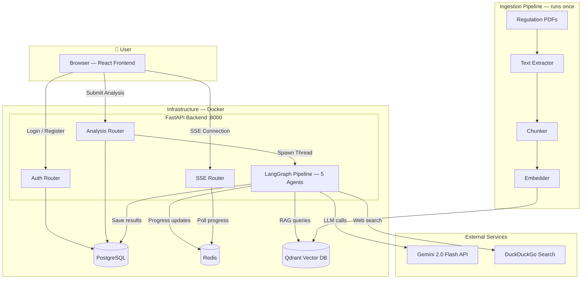

<div align="center">

# 🛡️ ComplianceAI

### AI-Powered Regulatory Compliance Analysis Agent

*Identify applicable regulations • Analyze compliance gaps • Score risks • Generate remediation plans*

[](https://python.org)
[](https://react.dev)
[](https://fastapi.tiangolo.com)
[](https://docker.com)
[](https://langchain-ai.github.io/langgraph/)
[](https://ai.google.dev)

---

</div>

## 🌟 What is ComplianceAI?

ComplianceAI is an intelligent agent system that helps businesses understand their regulatory compliance posture. It uses a **5-agent pipeline** powered by Google Gemini LLM and RAG (Retrieval-Augmented Generation) over real government regulation documents to:

1. 🔍 **Identify** which regulations apply to your business
2. 📋 **Analyze gaps** between your current state and legal requirements
3. ⚖️ **Score risks** with severity ratings for each compliance gap
4. 🔧 **Generate remediation** action plans with priorities and timelines
5. 📄 **Produce PDF reports** with full compliance analysis

---

## 🏗️ System Architecture



---

## 📦 Repositories

This project is organized as a multi-repo architecture. Each component has its own repository:

| Repository | Description | Tech Stack |
|-----------|-------------|------------|
| [**backend**](https://github.com/AI-Regulatory-Compliance-Agent/backend) | FastAPI API server + 5-agent LangGraph pipeline | Python, FastAPI, LangGraph, Gemini |
| [**frontend**](https://github.com/AI-Regulatory-Compliance-Agent/frontend) | React dashboard with real-time SSE progress tracking | React, Vite, Axios |
| [**ingestion**](https://github.com/AI-Regulatory-Compliance-Agent/ingestion) | One-shot PDF → vector embedding pipeline | Python, PyMuPDF, Sentence Transformers |
| [**Infrastructure**](https://github.com/AI-Regulatory-Compliance-Agent/Infrastructure) | Docker Compose orchestration + environment config | Docker, PostgreSQL, Redis, Qdrant |
| [**.github**](https://github.com/AI-Regulatory-Compliance-Agent/.github) | Organization profile, templates, and CI/CD | GitHub Actions |

---

## 🚀 Quick Start

### Prerequisites

- **Docker** and **Docker Compose** installed
- **Gemini API key** from [Google AI Studio](https://aistudio.google.com)
- Government regulation PDFs in `data/raw/`

### 1. Clone all repositories

```bash
mkdir complianceai && cd complianceai
git clone <org>/backend
git clone <org>/frontend
git clone <org>/ingestion
git clone <org>/Infrastructure
mkdir -p data/raw
# Place your regulation PDFs in data/raw/
```

### 2. Configure environment

```bash
cd Infrastructure
cp .env.example .env
# Edit .env with your GEMINI_API_KEY, database credentials, and JWT_SECRET_KEY
```

### 3. Launch

```bash
docker compose up --build
```

### 4. Access

| Service | URL |
|---------|-----|
| 🖥️ **Frontend** | http://localhost:5173 |
| ⚡ **Backend API** | http://localhost:8000 |
| 📚 **API Docs** | http://localhost:8000/docs |
| 🗄️ **Qdrant Dashboard** | http://localhost:6333/dashboard |

---

## 🔬 Agent Pipeline

Every compliance analysis flows through 5 sequential agents:

```
START → 🔍 Regulation Identifier → 📋 Gap Analysis → ⚖️ Risk Scoring → 🔧 Remediation → 📄 Report Generator → END
```

| # | Agent | What it does | Tools Used |
|:-:|-------|-------------|------------|
| 1 | **Regulation Identifier** | Finds which regulations apply to the company | Gemini LLM, Qdrant RAG, DuckDuckGo |
| 2 | **Gap Analysis** | Compares company profile against each regulation | Gemini LLM, Qdrant RAG |
| 3 | **Risk Scoring** | Scores each gap with severity (0–100) | Gemini LLM |
| 4 | **Remediation** | Generates actionable fix plans per gap | Gemini LLM, Qdrant RAG |
| 5 | **Report Generator** | Builds structured report + PDF, saves to DB | ReportLab, PostgreSQL |

### Analysis Modes

| Mode | Description | Web Search |
|------|-------------|:----------:|
| `self` | Analyze your own company (you provide all details) | ❌ |
| `external` | Analyze another company (web search supplements info) | ✅ |

### Information Levels

| Level | Confidence | Risk Output |
|-------|-----------|-------------|
| `full` | High (`CONFIRMED`) | Single score (e.g., 74/100) |
| `partial` | Medium (`PROBABLE`) | Range (e.g., 60–85) |
| `minimal` | Low (`UNKNOWN`) | Wide range (e.g., 40–90) |

---

## 🗄️ Data Storage

| Storage | Purpose | Lifetime |
|---------|---------|----------|
| **PostgreSQL** | Users, companies, analysis results (JSONB), PDF reports | Permanent |
| **Redis** | Session progress per analysis (SSE streaming) | Ephemeral |
| **Qdrant** | Government regulation chunks as 384-dim vectors | Permanent |
| **Temp Disk** | User-uploaded documents during analysis | Until restart |

---

## 🛠️ Tech Stack

<table>
<tr><th>Layer</th><th>Technology</th></tr>
<tr><td><strong>Frontend</strong></td><td>React 19, Vite 8, React Router, Axios</td></tr>
<tr><td><strong>Backend</strong></td><td>FastAPI, Python 3.11, Uvicorn</td></tr>
<tr><td><strong>AI/ML</strong></td><td>LangGraph, Google Gemini 2.0 Flash, Sentence Transformers</td></tr>
<tr><td><strong>Databases</strong></td><td>PostgreSQL 16, Redis 7, Qdrant</td></tr>
<tr><td><strong>PDF</strong></td><td>ReportLab (generation), PyMuPDF + Tesseract (extraction)</td></tr>
<tr><td><strong>Auth</strong></td><td>JWT (python-jose), bcrypt</td></tr>
<tr><td><strong>DevOps</strong></td><td>Docker Compose, multi-container orchestration</td></tr>
</table>

---

## 📄 License

- **Backend**, **Frontend**, **Ingestion**: [GNU GPL v2](https://www.gnu.org/licenses/old-licenses/gpl-2.0.html)
- **Infrastructure**: [MIT License](https://opensource.org/licenses/MIT)

